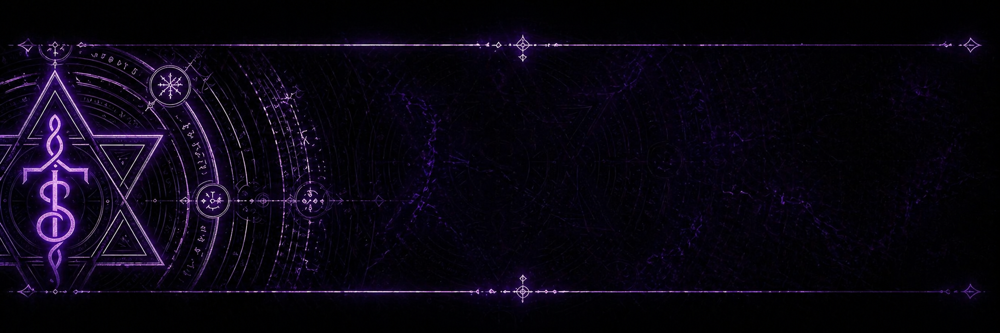

# Magus

A bootc OS image for the Framework Desktop with AMD Strix Halo. Purpose-built for LLM inference and containers — nothing else.

The entire machine state is three artifacts:

1. **One OCI image** — immutable OS with GPU drivers, device access, and service definitions
2. **One Ignition config** — user account, SSH keys, data disk
3. **One Brewfile** — userspace tooling

Factory reset is a re-image. Upgrades are `bootc upgrade`. Everything above the substrate is containers and brew.

## Hardware Target

| Component | Spec |
|-----------|------|
| Platform | Framework Desktop |
| APU | AMD Strix Halo (Ryzen AI Max) |
| GPU | RDNA 3.5 iGPU, 40 CUs |
| Memory | 128 GB unified (shared CPU/GPU) |
| GFX ID | gfx1151 |

128 GB of unified memory means 70B+ quantized models fit entirely in RAM through the iGPU. No discrete GPU needed.

## Design Principle

The OS image is the **stable substrate**. It moves slowly and provides:

- Kernel + amdgpu driver
- ROCm and Vulkan userspace libraries
- Firmware blobs
- Device access (udev rules, environment config)
- Quadlet service definitions

The **compute layer** lives above it — containers and brew. It moves fast and you can iterate without rebuilding the OS:

- Ollama (quadlet container, auto-starts)
- llama.cpp (ramalama, on-demand)
- vLLM (quadlet container, science experiment)

Complexity where it belongs. Substrate stays clean.

## GPU Stack

Two acceleration paths, both in the image:

**Vulkan (RADV)** — the reliable path. Mesa's RADV driver supports RDNA 3.5 natively. No overrides, no spoofing, it just works.

**ROCm** — the pain path that pays off. AMD's compute stack, but Strix Halo (gfx1151) is not on the official support matrix. Requires `HSA_OVERRIDE_GFX_VERSION=11.5.1` system-wide — baked into the image via `environment.d` and `profile.d` so you never have to think about it.

## LLM Runtimes

| Runtime | Runs as | GPU path | Port | Auto-start |
|---------|---------|----------|------|------------|
| **Ollama** | Custom container (quadlet) | Vulkan + coopmat | 11434 | Yes |
| **llama.cpp** | ramalama + custom image | Vulkan + coopmat | on-demand | No |
| **vLLM** | Custom container (quadlet) | ROCm | 8000 | No (science experiment) |

### Ollama

Custom-built container with Vulkan backend and coopmat shader patch (same pattern as [CobaltRush](https://github.com/lazypower/CobaltRush)). Ollama's vendored ggml is missing the coopmat feature-test shaders — we patch them from upstream llama.cpp so KHR_cooperative_matrix detection fires on RDNA 3.5. Starts at boot via quadlet:

```bash
ollama run llama3.3:70b        # pull and run
ollama list                    # see what's loaded
```

Build the container separately from the OS image:

```bash
just ollama                    # build
just push-ollama               # push to registry
```

### llama.cpp

Managed via [ramalama](https://github.com/containers/ramalama) — podman-native LLM management that handles container lifecycle, GPU passthrough, and model pulling. Ships in the OS image.

```bash
# run with stock image (auto-detects Vulkan)
ramalama run --backend vulkan huggingface://bartowski/Llama-3.3-70B-Instruct-GGUF

# run with custom coopmat-enabled image
ramalama run --backend vulkan --image ghcr.io/lazypower/magus-llama-cpp:latest ollama://llama3.3:70b

# serve an OpenAI-compatible API
ramalama serve --backend vulkan --port 8080 ollama://llama3.3:70b

# manage models
ramalama list
ramalama pull huggingface://TheBloke/Mixtral-8x7B-GGUF
```

The custom image in `containers/llama-cpp/` is built with Vulkan + coopmat for maximum throughput on RDNA 3.5. Use `--image` to point ramalama at it, or use stock images when coopmat isn't critical.

### vLLM

A science experiment. Thin wrapper over `rocm/vllm:latest` with Strix Halo environment overrides. vLLM's ROCm backend targets MI-series datacenter GPUs. RDNA 3.5 is uncharted territory. The quadlet is there so you can poke at it:

```bash
systemctl --user start vllm
just vllm                      # rebuild if needed
```

## Architecture

```
+----------------------------------------------------------+
|  Substrate (bootc image) — slow-moving, rarely rebuilt    |
|  Fedora 43 · amdgpu · ROCm libs · Vulkan (RADV) · fw    |
+----------------------------------------------------------+
|  Compute layer — fast-moving, iterate freely              |
|                                                           |
|  Quadlets             | ramalama    |  Host (brew)  |
|  +----------+ +-----+ | +--------+ |  +-----------+ |
|  |  Ollama  | |vLLM | | |llama   | |  |  CLI      | |
|  | (Vulkan) | |(ROCm| | |.cpp    | |  |  tools    | |
|  +----+-----+ +--+--+ | +---+----+ |  +-----------+ |
|       |           |    |     |      |                |
|  /dev/kfd        /dev/dri/renderD*  |                |
+----------------------------------------------------------+
|  Kernel: amdgpu · kfd · gpu_recovery=1                   |
+----------------------------------------------------------+
|  Hardware: Strix Halo · 128 GB unified · RDNA 3.5        |
+----------------------------------------------------------+
```

## Building

Requires podman on any Linux host:

```bash
just build
```

This builds the OCI image locally. To push to a registry:

```bash
just push
```

To generate the Ignition config from Butane:

```bash
just ignition
```

### Recipes

| Target | Description |
|--------|-------------|
| `build` | Build the bootc OS image |
| `ollama` | Build the Ollama container (Vulkan + coopmat) |
| `llama-cpp` | Build the llama.cpp container (Vulkan + coopmat) |
| `vllm` | Build the vLLM container (ROCm) |
| `all` | Build everything |
| `push` | Push OS image to registry |
| `push-ollama` | Push Ollama container to registry |
| `push-llama-cpp` | Push llama.cpp container to registry |
| `push-vllm` | Push vLLM container to registry |
| `push-all` | Push everything |
| `lint` | Run hadolint on the Containerfile |
| `ignition` | Transpile `magus.bu` to `ignition.json` |
| `clean` | Remove generated files |

## Deploying

### Fresh Install

Boot from a Fedora CoreOS ISO, then:

```bash
sudo bootc install to-existing-root \
  --target-imgref ghcr.io/lazypower/magus:latest
```

Supply `ignition.json` via the standard Ignition mechanisms (kernel arg, HTTP server, etc.).

### Upgrades

```bash
sudo bootc upgrade
```

Atomic. Rollback is one reboot away.

## First Boot

After Ignition runs, SSH in and bootstrap userspace:

```bash
~/.local/bin/bootstrap-brew.sh
```

This installs Linuxbrew and all packages from the Brewfile. From there, everything is `brew install` and `brew bundle`.

## Configuration Before Deploy

Two placeholders in `config/butane/magus.bu` need real values:

1. **SSH public key** — replace `REPLACE_WITH_SSH_PUBLIC_KEY`
2. **Data disk ID** — replace `REPLACE_WITH_DISK_ID` (find with `ls -l /dev/disk/by-id/`)

## File Layout

```
Containerfile                          # OS substrate image
Makefile                               # Build automation (all targets)
Brewfile                               # Userspace packages
containers/
  ollama/Containerfile                 # Custom Ollama (Vulkan + coopmat)
  llama-cpp/Containerfile              # Custom llama.cpp (Vulkan + coopmat)
  vllm/Containerfile                   # Custom vLLM (ROCm + Strix overrides)
config/
  butane/magus.bu                      # First-boot provisioning
  environment.d/10-rocm.conf           # HSA_OVERRIDE for systemd services
  profile.d/rocm.sh                    # ROCm PATH for login shells
  profile.d/brew.sh                    # Linuxbrew PATH for login shells
  udev/70-amdgpu.rules                # GPU device permissions
  modprobe.d/amdgpu.conf              # amdgpu kernel module options
  quadlets/ollama.container            # Ollama quadlet (points to custom image)
  quadlets/vllm.container              # vLLM quadlet (points to custom image)
```

### Where Things Live on the Running System

| Path | Contents | Mutable |
|------|----------|---------|
| `/usr/lib/environment.d/` | HSA override | No (image) |
| `/usr/lib/udev/rules.d/` | GPU device rules | No (image) |
| `/usr/lib/modprobe.d/` | Kernel module config | No (image) |
| `/usr/share/containers/systemd/` | Quadlet definitions | No (image) |
| `/etc/profile.d/` | Shell env scripts | Yes (3-way merge on upgrade) |
| `/var/data/` | Models, HF cache | Yes (persistent) |
| `/var/home/chuck/` | User home | Yes (persistent) |
| `/home/linuxbrew/.linuxbrew/` | Brew prefix | Yes (persistent) |

Override anything in the image layer by placing a file in the `/etc/` equivalent. The image provides vendor defaults; the admin layer is yours.

## Strix Halo Notes

- **gfx1151 is not officially supported by ROCm.** The `HSA_OVERRIDE_GFX_VERSION=11.5.1` workaround is baked in. If a ROCm workload misbehaves, try `11.5.0` by creating `/etc/environment.d/99-rocm-override.conf` — no rebuild needed.
- **Unified memory is the killer feature.** The iGPU shares the full 128 GB RAM pool via GTT. No VRAM wall, no PCIe bottleneck. The memory bandwidth tradeoff vs discrete is real, but for inference batch sizes of 1 it doesn't matter much.
- **vLLM on Strix Halo is a science experiment.** vLLM's ROCm backend targets MI-series datacenter GPUs. RDNA 3.5 is uncharted territory. The quadlet is there to make it easy to test — manage expectations accordingly.
- **Ollama is a custom container build**, not the upstream image. Built with the Vulkan backend and coopmat shader patch so KHR_cooperative_matrix fires on RDNA 3.5 (~50% throughput improvement). Lives in `containers/ollama/`, pattern adapted from [CobaltRush](https://github.com/lazypower/CobaltRush). Update independently from the OS with `just ollama push-ollama`.
